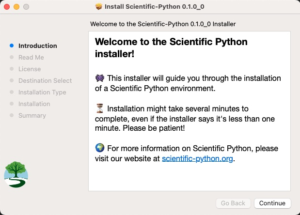

# Installers for core Scientific Python packages

Installers for the core Scientific Python packages for macOS, Windows, and Linux.



## Who should use these installers?

These installers are double click (macOS, Windows) or simple command line
installers (Linux) for the standard packages for general scientific Python and
data science.  The installer includes packages such as:

* Numpy (for arrays)
* Scipy (extended scientific computing)
* Matplotlib (plotting)
* Pandas (data science)
* Statsmodels (statistics)
* Scikit-Image (image processing)
* Scikit-Learn (machine learning and statistics)

as well as many others.  See the `./recipes/scientific-python/construct.yaml`
file for details.

We imagine these installers will be particularly useful for beginner students
taking courses in science, statistics or data science, to get them up and
running with a single download and install step.

## Where can I get the installers?

We will make a release soon.  When we have done so, please visit [the release
page](https://github.com/scientific-python/installer/releases/latest) to
download an installer for your OS. <!-- TODO: replace with link to tutorial
if/when written. -->

## Development

Locally, installers can be built using `tools/build_local.sh`. Steps:

1. Set up and activate a `conda` env with a forked version of `constructor`:
   ```console
   $ conda env create -f environment.yml
   $ conda activate constructor-env
   ```
2. Run `./tools/build_local.sh`.
3. Install the environment for your platform.
4. Test it using the `tests/`.
